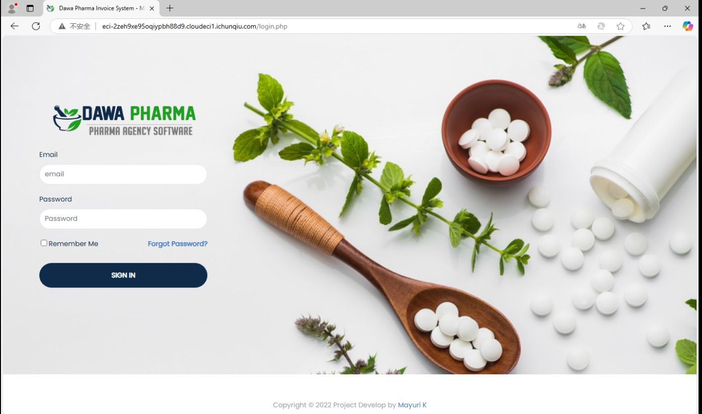
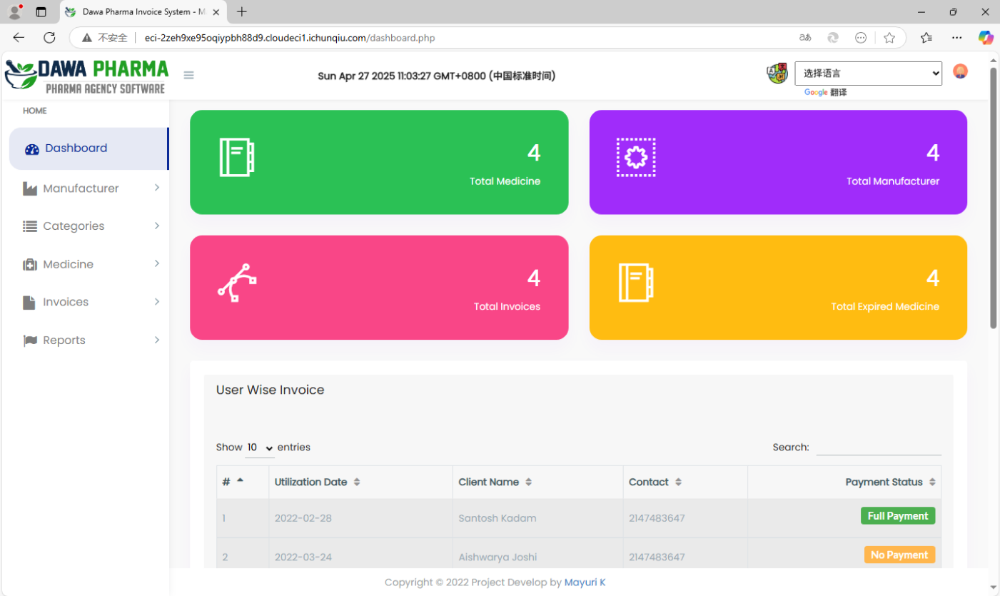
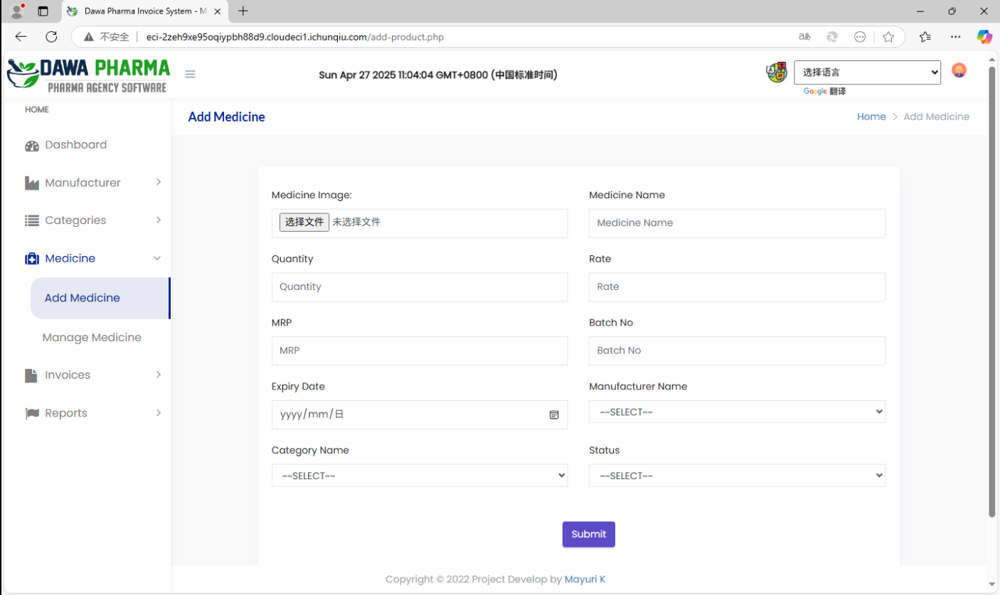
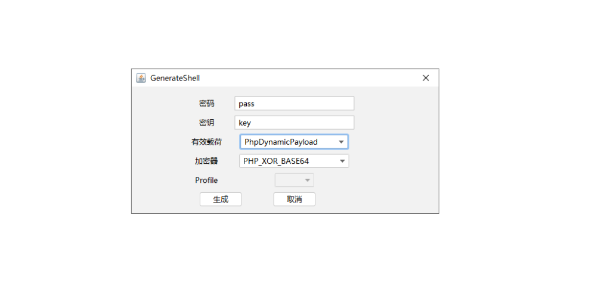
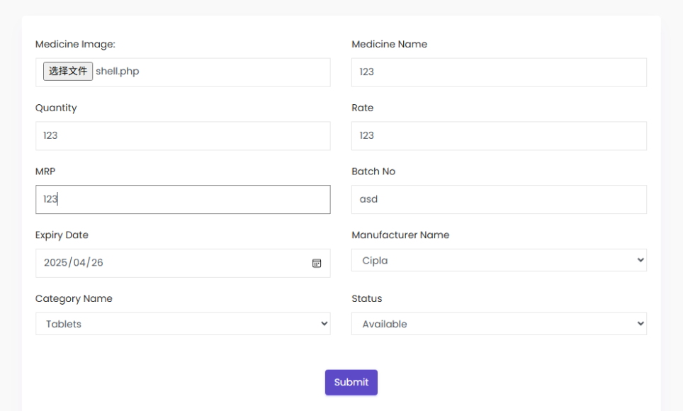
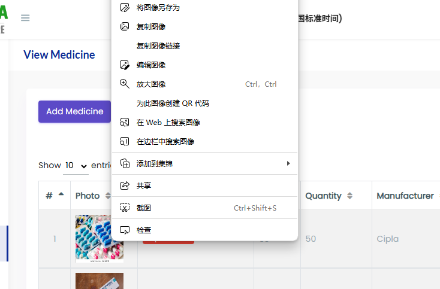
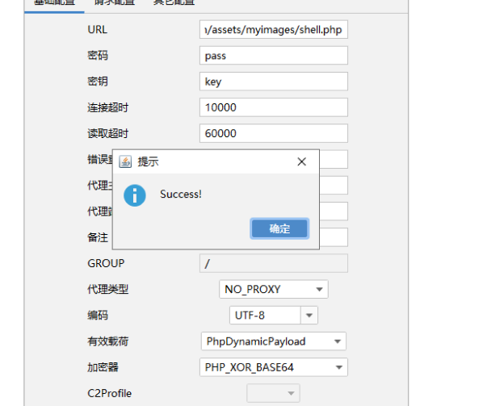
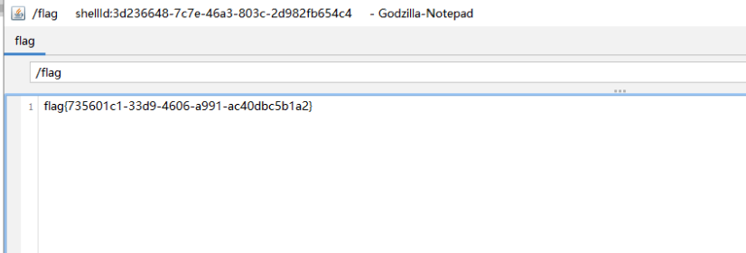

# CVE-2022-30887 漏洞利用过程记录

## 靶场首页

---

## 获取凭据
通过搜索获取到以下登录信息：  
- **邮箱**: mayuri.infospace@gmail.com  
- **密码**: mayurik  

---

## 登录后操作
1. 进入登录后的页面，寻找上传接口。  
     
2. 在指定位置找到上传功能入口。  
   

---

## 生成并上传木马文件
1. 使用 **Webshell管理工具（特斯拉）** 生成PHP木马文件（因网站URL以`.php`结尾）。  
     
2. 填写表单并上传木马文件。  
   

---

## 利用上传的木马
1. 复制上传图像的链接：  
   `http://eci-2zeh9xe95oqiypbh88d9.cloudeci1.ichunqiu.com/assets/myimages/tab.jpg`  
     
2. 修改链接为PHP木马路径并测试访问：  
   `http://eci-2zeh9xe95oqiypbh88d9.cloudeci1.ichunqiu.com/assets/myimages/shell.php`  
     

---

## 获取Flag
成功连接后，进入根目录找到Flag文件。  
